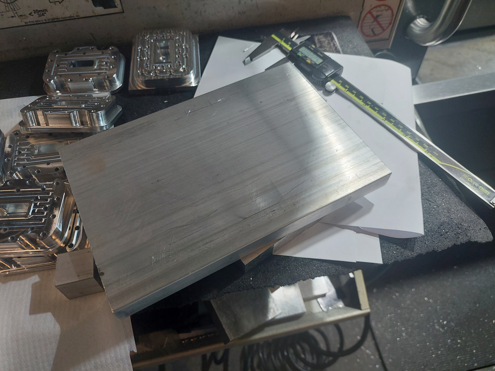
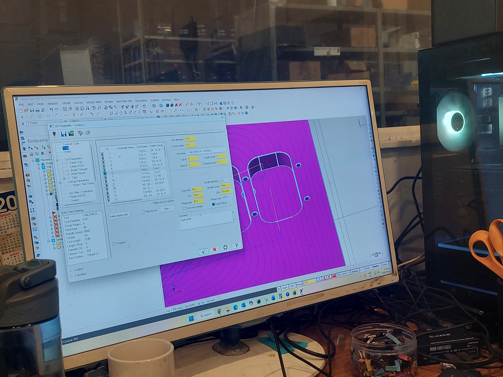
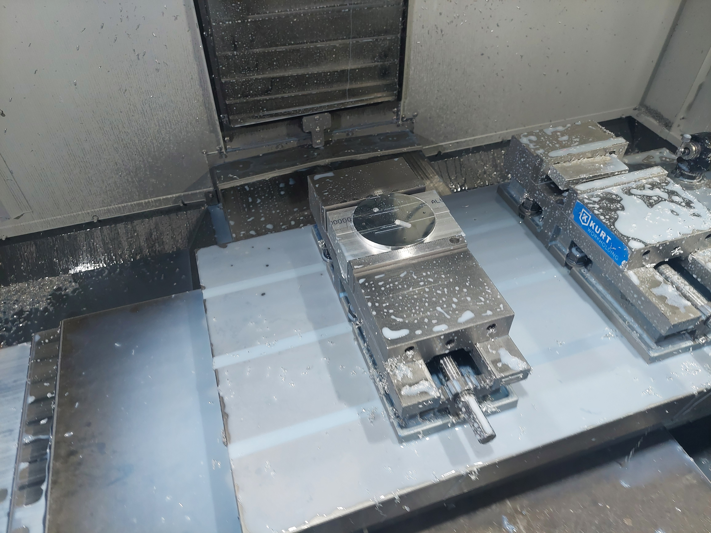

# SOVA (Spatial Object and Visual Assistant)

A physical robot that takes a natural language request, searches a room using depth perception, locates the requested object, and physically tracks it in real time. A complete perceive → reason → act loop running entirely on real hardware, not simulation.

## How It Works

1. You type a request in plain language. For example, "Find a tool I can take a picture with"
2. A locally-hosted LLM (Llama 3.2 via Ollama) reasons over SOVA's known object categories and picks the correct target. No keyword matching, only semantic reasoning over an open-ended request
3. SOVA's base rotates, sweeping the room while its depth camera searches
4. Once the object is detected, SOVA locks on, shows live distance on its onboard screen, and physically tracks it as it moves

## System Architecture

Three ROS2 nodes across two machines:

| Node | Runs on | Job |
|---|---|---|
| `command_interpreter_node` | PC | Takes a natural language request, uses a local LLM to map it to one of SOVA's known object classes, publishes the target |
| `perception_node` | Raspberry Pi 5 | Runs an OAK-D depth camera with an onboard YOLO detection model, searches for the target, publishes its 3D position and how far off-center it is in frame |
| `arduino_bridge_node` | Raspberry Pi 5 | Relays search/tracking state to the Arduino over serial, drives the base servo's search sweep and proportional tracking correction |

The Arduino itself runs minimal firmware. It receives simple serial commands (a target angle, a distance to display) and executes them immediately. All search and tracking logic lives in Python on the Pi, keeping the embedded side lightweight.

## Hardware

- Raspberry Pi 5
- Arduino Uno
- OAK-D Lite depth camera
- Feetech STS3215 smart servo (base rotation)
- Waveshare Bus Servo Adapter A (servo driver board)
- 0.96" SSD1306 OLED display (I2C)
- Aluminum 6061 base plate and servo mount, designed in SolidWorks and CNC-machined

## Software

- ROS2 Jazzy
- Python (perception, bridge, command interpreter nodes)
- C++ (Arduino firmware)
- DepthAI (OAK-D camera pipeline)
- Ollama (local LLM inference)
- U8g2 (OLED driver, page-buffer mode)

## Engineering Challenges

A few of the harder problems solved along the way:

**Hardware fault isolation.** The initial servo driver board stopped responding and immediately overheated on power-up. I isolated the board from the rest of the circuit, tested the servos independently, and verified the hardware failure using the manufacturer's diagnostic software. Swapping in a replacement board resolved this.

**Embedded memory optimization.** The Arduino's dynamic memory usage was at 94%, causing intermittent runtime crashes. The issue was a full-frame display buffer in the graphics library. I switched the library to page-buffer mode, dropping RAM usage to 50% and stabilizing the system entirely.

**Shared serial channel conflict.** The Arduino Uno only has one hardware serial channel, but both the servo driver and the Pi needed it. I moved the servo to a SoftwareSerial connection on separate pins and lowered the baud rate. I also had to patch the third-party servo library to accept a generic Stream interface instead of hardcoded hardware serial. This freed up the main hardware serial line for reliable Pi-to-Arduino communication.

## Mechanical Design & Fabrication

SOVA's structural hardware is my own design, made of aluminum 6061 that was CNC-machined.

<table>
<tr>
<td> Raw aluminum 6061 stock before machining</td>
<td> CAM toolpath programming for the base plate</td>
</tr>
<tr>
<td colspan="2" align="center"> The finished, machined upper rotating stage</td>
</tr>
</table>

Mounting hole patterns and fastener clearances were sourced directly from manufacturer reference CAD and datasheets. Load-bearing components like the servo are bolted directly, while lighter electronics are secured with mounting tape for rapid prototyping.

## Known Limitations & Next Steps

- SOVA runs one detection model at a time. The default is a general-purpose model covering 80 common object categories.
- The OAK-D camera can occasionally lose connection under sustained continuous use; a brief power cycle resolves it.

## Setup Notes

Note: To compile with software serial, the `SCServo` Arduino library requires a manual patch. In `SCSerial.h`, change `HardwareSerial *pSerial;` to `Stream *pSerial;`. This must be reapplied if the library is updated or reinstalled fresh.

## Author

Youcef Sellai 
Mechanical Engineering, Concordia University 
[linkedin.com/in/youcef-sellai](https://linkedin.com/in/youcef-sellai) · [github.com/sellai-youcef](https://github.com/sellai-youcef)
