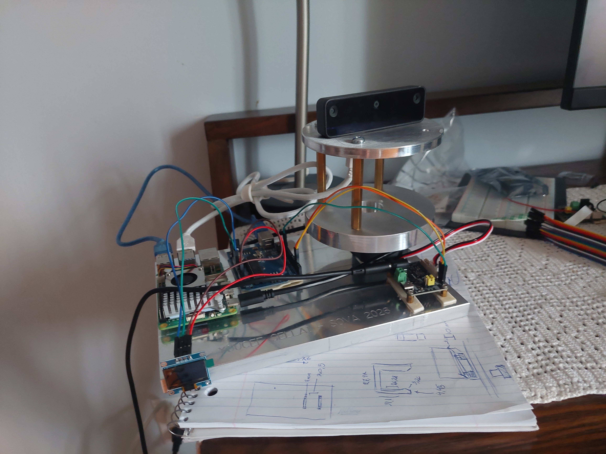

# SOVA (Spatial Object and Visual Assistant)

A physical robot that takes a natural language request, searches a room using depth perception, locates the requested object, and physically tracks it in real time — a complete perceive → reason → act loop running entirely on real hardware, not simulation.

## Demo

*Full tracking demo video coming soon*

## How It Works

1. You type or speak a request in plain language. For example, "Find a tool I can take a picture with"
2. A locally-hosted LLM (Llama 3.2 via Ollama) reasons over SOVA's known object categories and picks the correct target. No keyword matching, only genuine semantic reasoning over an open-ended request
3. SOVA's base rotates, sweeping the room while its depth camera searches
4. Once the object is detected, SOVA locks on, shows live distance on its onboard screen, and physically tracks it as it moves

## System Architecture

Three ROS2 nodes across two machines:

| Node | Runs on | Job |
|---|---|---|
| `command_interpreter_node` | PC | Takes a natural language request, uses a local LLM to map it to one of SOVA's known object classes, publishes the target |
| `perception_node` | Raspberry Pi 5 | Runs an OAK-D depth camera with an onboard YOLO detection model, searches for the target, publishes its 3D position and how far off-center it is in frame |
| `arduino_bridge_node` | Raspberry Pi 5 | Relays search/tracking state to the Arduino over serial, drives the base servo's search sweep and proportional tracking correction |

The Arduino itself runs minimal firmware — it receives simple serial commands (a target angle, a distance to display) and executes them immediately. All search and tracking logic lives in Python on the Pi, keeping the embedded side lightweight.

## Hardware

- Raspberry Pi 5
- Arduino Uno
- OAK-D Lite depth camera
- Feetech STS3215 smart servo (base rotation)
- Waveshare Bus Servo Adapter A (servo driver board)
- 0.96" SSD1306 OLED display (I2C)
- Aluminum 6061 base plate and servo mount, designed in SolidWorks and CNC-machined

## Software

- ROS2 Jazzy
- Python (perception, bridge, command interpreter nodes)
- C++ (Arduino firmware)
- DepthAI (OAK-D camera pipeline)
- Ollama (local LLM inference)
- U8g2 (OLED driver, page-buffer mode)

## Engineering Challenges

A few of the harder problems solved along the way:

**Hardware fault isolation.** The first servo driver board stopped responding entirely. When powered, the board experienced an immediate and abnormal heat buildup, becoming hot to the touch within seconds, a clear indicator of an internal short circuit or hardware defect. Rather than assuming a software or wiring issue, I systematically ruled out the surrounding components (wiring, individual servos, firmware) and confirmed the hardware failure using the manufacturer's diagnostic software running independently of my code. Replacing the defective board immediately restored system functionality.
**Embedded memory optimization.** The Arduino's dynamic memory usage sat at 94%, causing intermittent, hard-to-reproduce failures. I identified the cause as a full-frame display buffer in the graphics library and switched to page-buffer mode, dropping usage to 50% and eliminating the failures entirely.
**Shared serial channel conflict.** The Arduino Uno has exactly one hardware serial channel, shared between its USB port and its TX/RX pins. With the servo driver board and the Pi both needing that same channel, neither could communicate reliably. I moved the servo to a software-emulated serial connection on separate pins, lowered its baud rate to match, and patched the servo library itself to accept a generic serial interface instead of being hardcoded to hardware serial, freeing the real hardware serial line for the Pi alone.

## Mechanical Design & Fabrication

SOVA's structural hardware is my own design, not off-the-shelf.

<table>
<tr>
<td> Raw aluminum 6061 stock before machining</td>
<td> CAM toolpath programming for the base plate</td>
</tr>
<tr>
<td colspan="2" align="center"> The finished, machined base plate</td>
</tr>
</table>

Mounting hole patterns and fastener clearances were sourced from manufacturer reference CAD and datasheets rather than estimated. Load-bearing components, like the servo, are bolted directly; lighter electronics are secured with mounting tape to allow rapid reconfiguration during active development.
## Known Limitations / Next Steps

- Servo tracking is functional but still being tuned. Some oscillation remains at current gain settings
- SOVA runs one detection model at a time. The default is a general-purpose model covering 80 common object categories.
- The OAK-D camera can occasionally lose connection under sustained continuous use; a brief power cycle resolves it

## Setup Notes

If you're building on this repo, the `SCServo` Arduino library needs one manual patch to compile with software serial: in `SCSerial.h`, change `HardwareSerial *pSerial;` to `Stream *pSerial;`. This isn't part of this repo, it's a third-party library so the patch needs to be reapplied if the library is reinstalled fresh.

## Author

Youcef Sellai — Mechanical Engineering, Concordia University
[linkedin.com/in/youcef-sellai](https://linkedin.com/in/youcef-sellai) · [github.com/sellai-youcef](https://github.com/sellai-youcef)
